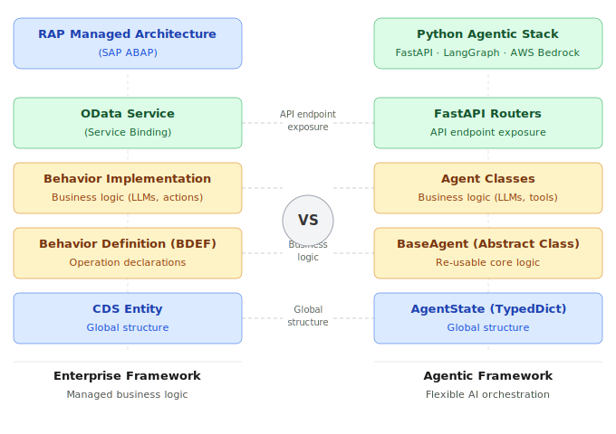

# Cloud-Native Payment Reconciliation Engine

> Production-grade payment reconciliation system built on AWS — directly mirroring
> $350M SAP TM financial settlement architecture on cloud-native infrastructure.


-brightgreen?style=flat)
-blue?style=flat)

---

## What This Is

A payment reconciliation engine built to prove that enterprise financial settlement patterns
translate directly to cloud-native infrastructure — without losing the integrity guarantees
required for $350M+ in financial volumes.

**Phase 1 is live on AWS (ap-south-1).** Phase 2 adds a LangGraph multi-agent layer with
Amazon Bedrock RAG for natural language querying of financial audit logs.

---

## Architecture

```
POST /payments
       │
       ▼
  API Gateway
       │
       ▼
  Lambda (FastAPI / Mangum)
       │
       ├──► DynamoDB  (persist payment record, idempotency check)
       │
       └──► SQS Queue (async reconciliation job)
                │
                ▼
        Lambda Consumer
                │
                ▼
         DynamoDB update → status: RECONCILED

Natural language query
       │
       ▼
  LangGraph Agent  (Phase 2)
       │
       ├── REF-xxx query  ──► DynamoDB tool call
       └── Open question  ──► Bedrock RAG (Titan embeddings + ChromaDB)
```
> Implements E2A two-layer idempotency pattern and DLQ governance.
> [E2A Framework](https://github.com/subhamviky/e2a-framework)
---

## Key Engineering Decisions

| Decision | Implementation | Why |
|----------|---------------|-----|
| **Two-layer idempotency** | Application-level GSI query + DB-level conditional expression | Exactly-once write guarantee — same pattern as $350M settlement engine |
| **Async processing** | POST returns PENDING immediately; SQS consumer reconciles async | Decouples ingestion from processing; handles backpressure |
| **DLQ escalation** | Failed messages → DLQ after 3 retries + CloudWatch alarm | Zero silent drops; every failure is surfaced |
| **Exponential backoff** | Lambda retry policy with jitter | Prevents thundering herd on downstream services |
| **Correlation ID threading** | Every log line carries request ID | Full distributed traceability across Lambda invocations |
| **Agent routing** | LangGraph routes by query type: lookup vs. open question | Avoids RAG overhead for direct reference lookups |

## Architectural Mental Model

The same patterns proven at $350M SAP TM financial settlement scale
translate directly to cloud-native and AI-native systems.


---

## AWS Services

| Service | Purpose |
|---------|---------|
| Lambda + Mangum | Serverless FastAPI deployment |
| API Gateway | HTTP API with rate limiting |
| DynamoDB | Payments table, PAY\_PER\_REQUEST billing, GSI for idempotency |
| SQS + DLQ | Async payment processing with failure escalation |
| CloudWatch | Structured logging with correlation ID threading |
| Amazon Bedrock | Titan embeddings for Phase 2 RAG pipeline |

---

## Phase Status

### Phase 1 — Complete (Live on AWS ap-south-1)

- [x] FastAPI service layer on Lambda via Mangum
- [x] Async event processing: POST → SQS → Lambda Consumer → RECONCILED
- [x] Two-layer DynamoDB idempotency pattern
- [x] DLQ escalation with exponential backoff
- [x] CloudWatch structured logging with correlation ID threading
- [x] Terraform IaC for Lambda, API Gateway, DynamoDB, SQS

### Phase 2 — Targeted Q2 2026

- [ ] LangGraph multi-agent workflow
- [ ] Amazon Bedrock RAG — natural language querying of financial audit logs
- [ ] Bedrock Titan embeddings replacing local ChromaDB
- [ ] Agent routing: reference lookups vs. open RAG queries

---

## Run Locally

```bash
# Clone and set up
git clone https://github.com/subhamviky/aws-reconciliation-engine.git
cd aws-reconciliation-engine

python -m venv venv
source venv/bin/activate      # Windows: venv\Scripts\activate
pip install -r requirements.txt

# Run the API
uvicorn src.api.main:app --reload

# Swagger UI available at:
# http://localhost:8000/docs
```

---

## Deploy to AWS

```bash
# Configure AWS credentials first
aws configure

# Deploy via script
./deploy.sh
```

---

## Run Tests

```bash
pytest tests/ -v
```

---

## Cloud Portability

| AWS | GCP | Purpose |
|-----|-----|---------|
| Lambda | Cloud Run | Serverless compute |
| Bedrock (Titan) | Vertex AI | LLM + embeddings |
| SQS | Pub/Sub | Async message queue |
| DynamoDB | Firestore | Persistence + idempotency |
| CloudWatch | Cloud Monitoring | Observability |

LangGraph patterns are vendor-agnostic across AWS, GCP, and Azure.

---

## Related Project

**[order-to-cash-agentic-ai](https://github.com/subhamviky/order-to-cash-agentic-ai)** —
Order-to-Cash Agentic AI Platform. 5-agent LangGraph system with hybrid OpenSearch RAG,
MCP-style tool microservices, and full Terraform IaC. Phase 2 in progress.

---

## Author

**Subham Gupta** — Staff Architect & AI Architect, SAP Labs India

[LinkedIn](https://www.linkedin.com/in/subham-gupta-0a05a058) · [Email](mailto:subhamviky@gmail.com)
